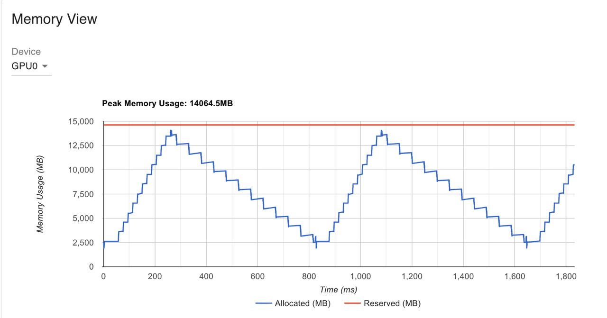
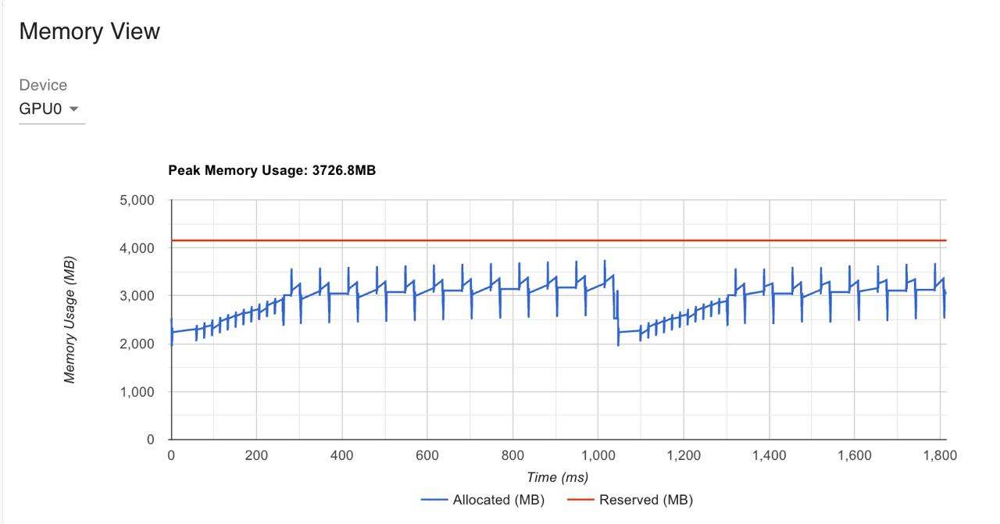
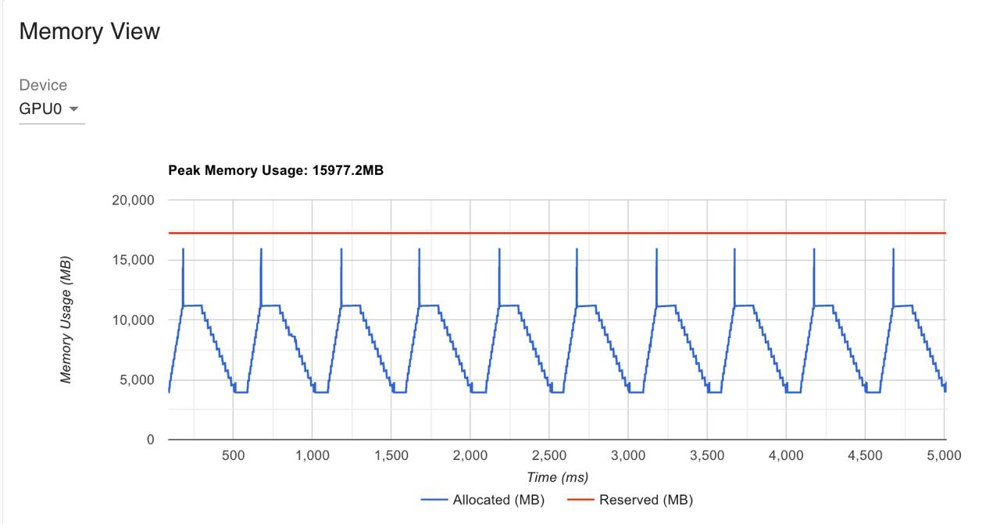
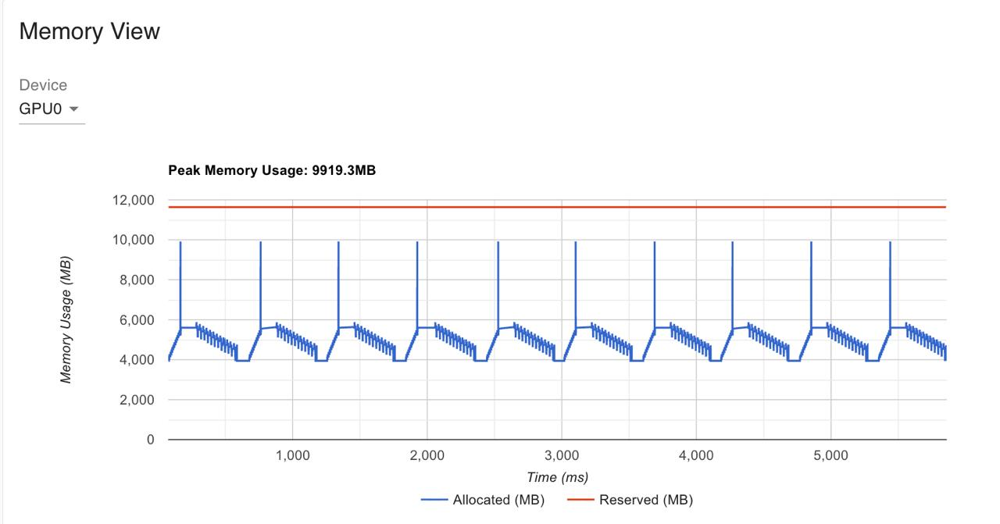
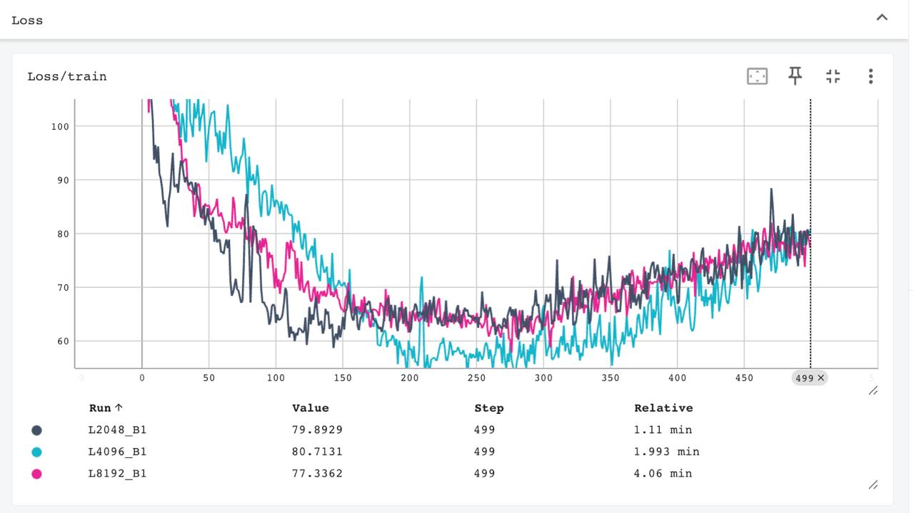
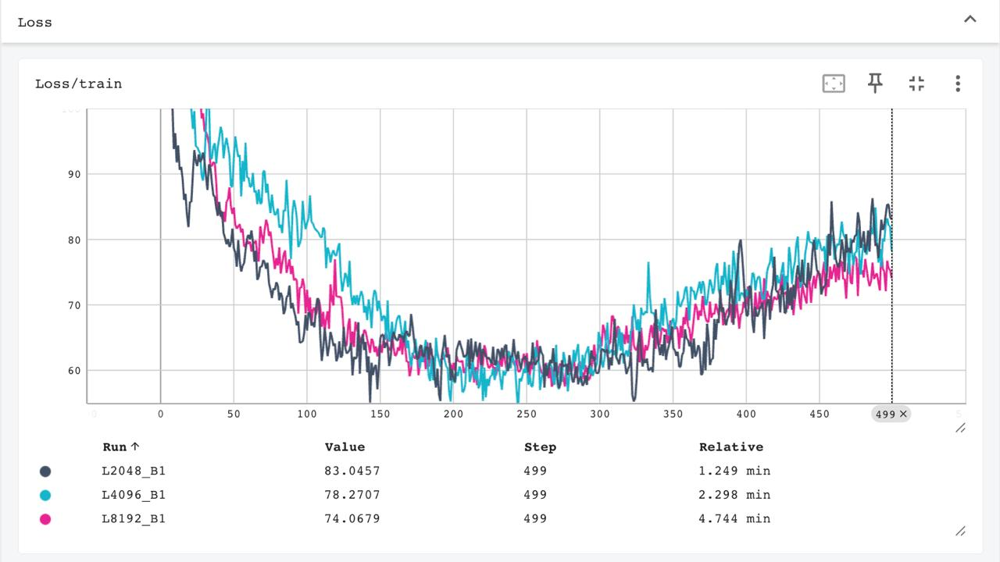

# activation_checkpointing
Reentrant activation checkpointing algorithm from scratch

There is 2 experiments: with the syntetic data (```run_syntetic.py```) and with wikidata (```run_lm_model.py```).
Activation checkpointing is in ```activation_checkpoint.py```
Basic Transformer and Language model is in ```model.py```

# Run the syntetic data experiment
```bash
# Setup uv packet manager
pip install uv
uv sync

# Run the baseline
uv run python run_syntetic.py --method baseline --profile_dir baseline/

# Run the activation checkpoint version
uv run python run_syntetic.py --method checkpoint --profile_dir checkpoint/

# Run with the concrete batch_size and seq_len_list
uv run python run_syntetic.py --B 1 --L_list 2048 4096 8192

# Run the tensoboard
uv run tensorboard --logdir baseline --port 6006

# SSH tunnel on local machine
ssh -L 6006:localhost:6006 root@localhost -p 8022

# Run the test with loss, outputs and gradients equaility
uv run pytest test_activation_checkpointing.py
```

## Tensorboard is avaliable here
http://localhost:6006/#pytorch_profiler


## GPU pick memory comparison & Time of the 14 steps experiment

| seq_len | batch_size | Baseline (MB) | Checkpoint (MB) | Baseline (sec) | Checkpoint (sec) | 
|---:|---:|---:|---:|---:|---:|
| 2048  | 1 | 3603.4565 | 3001.5044 | 4.45 | 5.70 |
| 4096  | 1 | 5097.8940 | 3017.5044 | 4.74 | 6.54 |
| 8192  | 1 | 8086.7690 | 3053.9893 | 7.60 | 9.08 |
| 12288 | 1 | 11075.6440 | 3390.3955 | 10.16 | 13.06 |
| 16384 | 1 | 14064.5190 | 3726.8018 | 15.10 | 18.43 |

## Memory profiler L=16k, B=1


### Baseline
 

### With activation checkpointing
 


# Run the wikidata pretrain experiment

```bash
# Run the baseline
uv run python run_lm_model.py --method baseline --profile_dir baseline/

# Run the activation checkpoint version
uv run python run_lm_model.py --method checkpoint --profile_dir checkpoint/
```

## GPU pick memory comparison & Time of the 500 steps experiment

| seq_len | batch_size | Baseline (MB) | Checkpoint (MB) | Baseline (sec) | Checkpoint (sec) | 
|---:|---:|---:|---:|---:|---:|
| 2048 | 1 | 6649.7 | 4919.0 | 69.05 | 77.30 |
| 4096 | 1 | 9760.5 | 6587.5 | 121.31 | 139.44 |
| 8192 | 1 | 15977.2 | 9919.3 | 245.42 | 288.16 |

## Memory profiler L=8k, B=1

### Baseline
 

### With activation checkpointing
 


## Loss functions for L=2k, 4k, 8k; B=1

### Baseline
 

### With activation checkpointing
 
